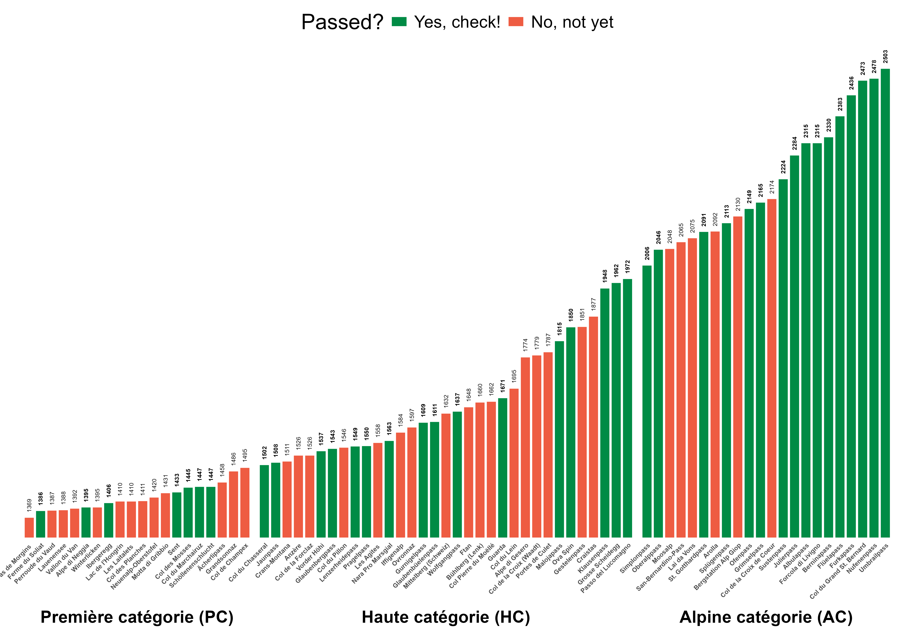
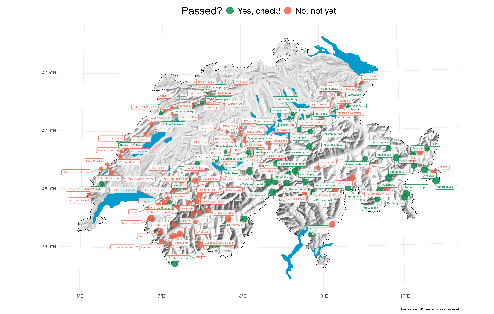

# **PassBook** – Mapping your bike-climbed passes

**PassBook** is an R-based tool that tracks and visualizes your ascents of mountain passes across Europe, using data from **Strava** and **quälldich.de**.

### What it does 🔍

- Automatically detects which passes you've climbed using your **Strava** activity data.
- Cross-references climbs with pass data from **quälldich.de**.
- Supports **Switzerland**, **France**, **Spain**, and **Italy**.
- Provides both **statistical** and **spatial** visualizations of your achievements.

## Prerequisites ✅

- A valid **Strava** account (with activity data).
- **R** and basic R knowledge to run the scripts. 

## User guide 📘
This is a step-by-step guide on how to use the app:
- Navigate to https://www.strava.com/settings/api
- Set up your Strava API by specifying your app name
- 
- Insert the app name, user ID, and client secret into lines 6 to 8 of the PassBook.R script
- Press Run

## Example Visualizations 📊

### Bar Graph of Climbed Passes (Switzerland)

### Spatial Plot of Climbed Passes (Switzerland)

## What is to come 

A publicly accessible Shiny app that lets you view your climbed passes through an easy-to-use GUI—no coding required.

## Licence 

<a href="https://github.com/luccalino/PassBook">PassBook</a> © 2025 by <a href="https://creativecommons.org">Lucca Zachmann</a> is licensed under <a href="https://creativecommons.org/licenses/by-nc/4.0/">CC BY-NC 4.0</a>
